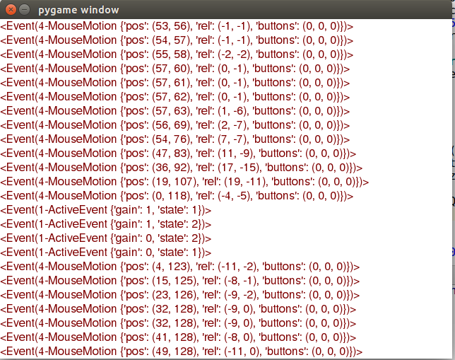

# 文档

### 2017. 6. 7:
#### Step2
   完成了对screen, 与surface的基本理解, 但是对surface.convert还有点小疑惑, 主要理解起来不太容易
   今天在教程源代码基础上改了点东西, 使得fps字体显示在screen中, 而不是caption中

### 2017. 6. 8:
####Step3 - Surfaces and Drawing

####  遗留问题
1. 有个思考题是画5角星的, 但是没找到好的方法画出来, 先作为思考题
2. 课后还有个OOP的编程, 到时还要继续补充完

### 2017. 6. 9:
#### Step3 
#### 任务
继续完成昨天的几个问题

#### 昨日任务完成
星型不过不是用polygon画的, 而是用line连起

#### 遗留问题, 想写一个Eventcatch, 然后重复展现到屏幕上

### 2017. 6. 10

###任务
完成一个EventCatch , 效果还行
完成了Chapter的第一个部分colorkey

###问题
font.get_linesize()这个方法到底有与 font的大小有什么区别, 在例子中我的fontsize为16 , 但是get_linesize()得到的值为20

###截图

###遗留问题
想在colorkey.py 再绘制个圆形沿直线运动的画面

### 2017. 6. 12

####内容

#####First
本章内容主要是对alpha这个值的理解, alpha值主要影响着suface的透明度, 但由于图片格式不同, 所以不一定每种格式都会有alpha的值, 比如jpeg就没有
但是我们可以通过改变一些方法使得其对能有alpha的作用
set_alpha

1. 可以看出, alpha的增大, 图片的透明度是降低的, 但alpha为0时, 支持alpha就会变成全透明
2. 对于左下角的第二章set colorkey, 当且进当surface的像素为(255, 255, 255)时 才会变为全透明(假设设置的colorkey 为(255, 255, 255))
3. 对于最后每一个像素设置pixel-alpha, 因为jpg并没有alpha通道, 所以对jpg图片是没有用的, 但是png有着alpha通道, 所以会起到相应的效果

####second
下午的时候有学习到相应窗口变化的事件.
1. 如果我们需要对于screen定制窗口伸缩, 首先必须在display.set_mode中, 第二个参数定义为pygame.RESIZABLE,(第二个参数为显示模式).
2. 其实, 窗口的伸缩肯定为操作系统中的一个事件, 那么我们就需要捕获event.type == pygame.VIDEORESIZE, 这一事件, 这一事件包括三个属性 ,size, w, h 

3. 添加了一个Resize的练习
4. 