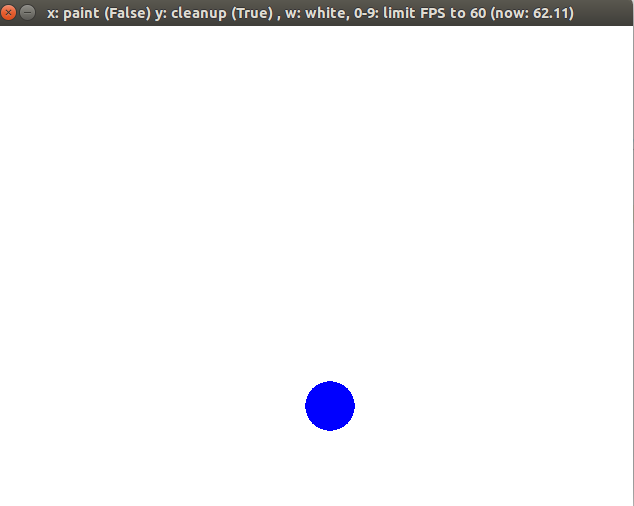

# 文档

### 2017. 6. 7:
#### Step2
   完成了对screen, 与surface的基本理解, 但是对surface.convert还有点小疑惑, 主要理解起来不太容易
   今天在教程源代码基础上改了点东西, 使得fps字体显示在screen中, 而不是caption中

### 2017. 6. 8:
####Step3 - Surfaces and Drawing

####  遗留问题
1. 有个思考题是画5角星的, 但是没找到好的方法画出来, 先作为思考题
2. 课后还有个OOP的编程, 到时还要继续补充完


### 2017. 6. 9:
#### Step3 
#### 任务
继续完成昨天的几个问题


#### 昨日任务完成
星型不过不是用polygon画的, 而是用line连起

#### 遗留问题, 想写一个Eventcatch, 然后重复展现到屏幕上


### 2017. 6. 10

###任务
完成一个EventCatch , 效果还行
完成了Chapter的第一个部分colorkey

###问题
font.get_linesize()这个方法到底有与 font的大小有什么区别, 在例子中我的fontsize为16 , 但是get_linesize()得到的值为20


###截图


###遗留问题
想在colorkey.py 再绘制个圆形沿直线运动的画面

### 2017. 6. 12

####内容 : Step4

#####First
本章内容主要是对alpha这个值的理解, alpha值主要影响着suface的透明度, 但由于图片格式不同, 所以不一定每种格式都会有alpha的值, 比如jpeg就没有
但是我们可以通过改变一些方法使得其对能有alpha的作用
set_alpha

1. 可以看出, alpha的增大, 图片的透明度是降低的, 但alpha为0时, 支持alpha就会变成全透明
2. 对于左下角的第二章set colorkey, 当且进当surface的像素为(255, 255, 255)时 才会变为全透明(假设设置的colorkey 为(255, 255, 255))
3. 对于最后每一个像素设置pixel-alpha, 因为jpg并没有alpha通道, 所以对jpg图片是没有用的, 但是png有着alpha通道, 所以会起到相应的效果


####second
下午的时候有学习到相应窗口变化的事件.
1. 如果我们需要对于screen定制窗口伸缩, 首先必须在display.set_mode中, 第二个参数定义为pygame.RESIZABLE,(第二个参数为显示模式).
2. 其实, 窗口的伸缩肯定为操作系统中的一个事件, 那么我们就需要捕获event.type == pygame.VIDEORESIZE, 这一事件, 这一事件包括三个属性 ,size, w, h 

3. 添加了一个Resize的练习


### 2017. 6. 13

####内容 Step5
1. Frame-base movement


####注意到的几个问题
1. 对于该程序的staticDraw的原理, 无非就是将其画在background上, 而且该ball并没有加入到moveing函数内, 所以他的x, y轴并不会移动. (对于画在background还是screen我觉得并不是关键, 关键在于是否在loopaction中绘制的) , 只不过staticDraw如果flip()之后原先的ball就会消失, 所以staticDraw时 画在background上,background是不会被Refresh掉的. 
2. 对于这三局语句
````
self.screen.blit(self.background, (0, 0))
draw()
pygame.display.flip()
````
最好注意一下优先顺序, 不然如果draw了之后, 再draw上background, 那么background不是透明的, 就会将screen上的ball给覆盖掉


### 2017. 6. 14

####内容 Step6
1. Time-Based movement
昨天的程序中, 开始是的, 所以是Frame-base movement, 就是说移动距离每一帧是一样的, 所以会导致帧数会影响ball的移动速度, 为了避免机器性能间差异导致的图形移动差异, 可以采用Time-base movement, 如下代码所示, 每一帧的时间不同, 但总体1秒内移动的距离是一样的, 但是如果帧数过低, 会出现卡顿的效果

```
    ballx += dx * seconds #以时间为单位移动
    bally += dy * seconds
```
<center>



</center>


### 2017.6 . 15
####内容 Step7 Loading File, Subsurface
其中的内容主要牵扯到了subsurface, 当我们需要surface中一部分时, 用到的一般就是subsurface, 
* prettybackground.subsurface((x,y,snakerect.width, snakerect.height)) (类似于Rect的初始化, x, y, width, height)


### 2017. 6. 16
####内容 Step8 Animation
这章主要应该主要是在Sprite前的简单animation, 如小时候看到的一些翻漫一样, 就是几张图片的切换, 通过之前学的Frame-Base的循环, 也可以做到相应的效果.
基本上这一章也没有什么相应的难点.


### 2017. 6. 22
####内容 Step9  Tile-based Graphics
这章内容我更想把他理解为用图形元素构造出的简单游戏画面.., 具体的难点没有什么, 只要注意原矩阵与具体边框大小的比例缩放, 以及相应的 filp()操作. 


### 2017. 6. 23
####内容 Step10 Using Sound and Music
好像Pygame只支持了.wav, .ogg的音频文件

* Initializing the Mixer, 
```
pre_init(frequency=22050, size=-16, channels=2, buffersize=4096)
```

* Loading music and sound files
```
try:
    pygame.mixer.music.load(os.path.join('data', 'an-turr.ogg'))#load music
    jump = pygame.mixer.Sound(os.path.join('data','jump.wav'))  #load sound
    fail = pygame.mixer.Sound(os.path.join('data','fail.wav'))  #load sound
except:
    raise UserWarning, "could not load or play soundfiles in 'data' folder :-("
```

### 2017. 6. 24
昨天没有太多时间所以短短的内容两天做完..
这里只是简单的说明了对于pygame如果使用sound和music, 一般对于sound来说, 通常用一个变量记录下Sound, 在某种触发时候就.play(), 和对于music来说, 一般是用music.play, 不过应该也可以用一个变量记录相应的music吧, 然后在某个时候调用其play()

顺便可以提下可以用pygame.mixer.music.get_busy(), 返回bool值确定当前背景音乐是否有触发